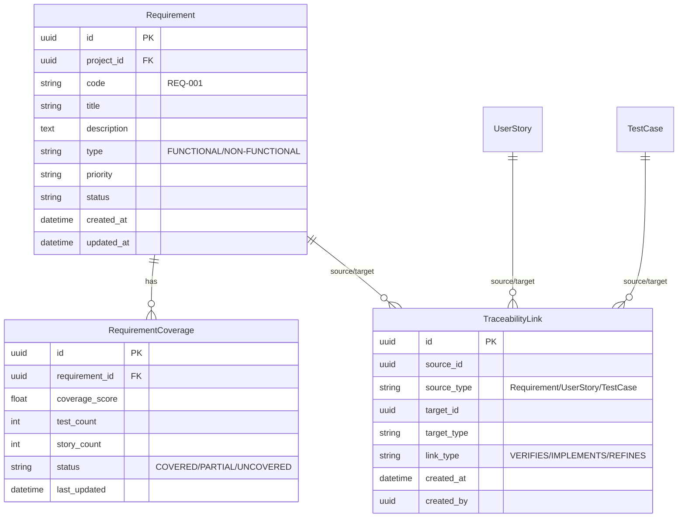

# Diseño Técnico de Trazabilidad Global (T1.1)

## 1. Visión General
Este documento define el modelo de datos para implementar la trazabilidad completa entre Requerimientos, Historias de Usuario y Casos de Prueba en Nexus Railway.

## 2. Diagrama ER Conceptual

## 3. Definición de Modelos

### 3.1 Requirement
Representa una necesidad de negocio o restricción técnica.

*   **Campos:**
    *   `id`: UUID, Primary Key.
    *   `project_id`: UUID, Foreign Key a Projects (si existe, o string).
    *   `code`: String (50), identificador único legible (ej. "REQ-AUTH-001").
    *   `title`: String (200).
    *   `description`: Text/Markdown.
    *   `type`: Enum (FUNCTIONAL, NON_FUNCTIONAL, BUSINESS_RULE).
    *   `priority`: Enum (CRITICAL, HIGH, MEDIUM, LOW).
    *   `status`: Enum (DRAFT, REVIEW, APPROVED, DEPRECATED).
    *   `source_document_id`: UUID, opcional (link al documento origen).
    *   `created_at`: DateTime.
    *   `updated_at`: DateTime.

### 3.2 TraceabilityLink
Tabla polimórfica para enlazar cualquier artefacto con otro.

*   **Campos:**
    *   `id`: UUID, Primary Key.
    *   `source_id`: UUID.
    *   `source_type`: String (50) - Nombre de la clase/tabla (e.g., "Requirement").
    *   `target_id`: UUID.
    *   `target_type`: String (50) (e.g., "TestCase").
    *   `link_type`: Enum (VERIFIES, IMPLEMENTS, REFINES, DEPENDS_ON).
    *   `created_at`: DateTime.
    *   `meta`: JSON (para guardar detalles extra del enlace si es necesario).

### 3.3 RequirementCoverage
Tabla de resumen para consultas rápidas de estado de cobertura.

*   **Campos:**
    *   `id`: UUID, Primary Key.
    *   `requirement_id`: UUID, Unique Foreign Key.
    *   `total_tests`: Integer.
    *   `passing_tests`: Integer.
    *   `total_stories`: Integer.
    *   `completed_stories`: Integer.
    *   `coverage_status`: Enum (UNCOVERED, PARTIAL, FULL_COVERAGE).
    *   `last_calculated_at`: DateTime.

## 4. Estrategia de Implementación
Se utilizará SQLAlchemy para la definición de modelos.
Se deben establecer índices en `source_id/source_type` y `target_id/target_type` para búsquedas bidireccionales eficientes.
