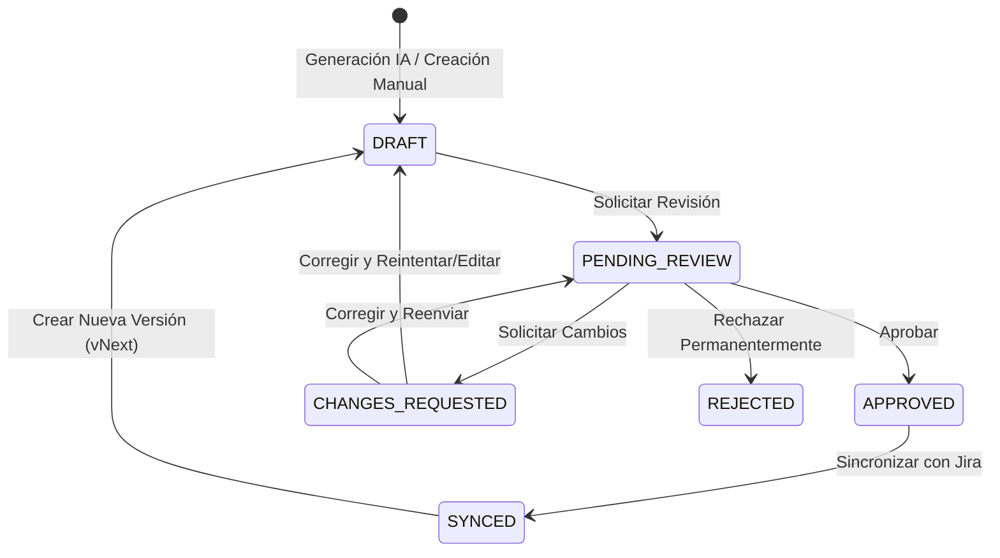

# Diseño de Workflow de Aprobación (Enterprise)

**ID de Tarea**: W1.1  
**Versión**: 1.0  
**Fecha**: 2026-01-07  
**Estado**: En Desarrollo

---

## 1. Visión General y Objetivos

El objetivo principal del workflow de aprobación es introducir un **"Gate de Calidad"** formal entre la generación de artefactos por IA y su despliegue en sistemas externos (Jira). Esto mitiga el riesgo de introducir información incorrecta o alucinaciones en el entorno productivo.

### Objetivos Clave
1.  **Garantía de Calidad**: Asegurar que todo artefacto (Caso de Prueba o Historia de Usuario) sea revisado por un humano antes de ser "oficial".
2.  **Compliance y Auditoría**: Registrar quién aprobó qué y cuándo.
3.  **Prevención de Errores**: Bloquear la subida a Jira de borradores o artefactos rechazados.
4.  **Ciclo de Feedback**: Facilitar la comunicación entre Generador (IA/Dev) y Revisor (PO/QA Lead).

---

## 2. Máquina de Estados (Finite State Machine)

El ciclo de vida de un artefacto se regirá por los siguientes estados.

### Definición de Estados

| Estado | Código | Descripción | ¿Editable? | ¿Sincronizable? |
|---|---|---|---|---|
| **Borrador** | `DRAFT` | Estado inicial tras creación (manual o IA). Trabajo en progreso. | ✅ Sí | ❌ No |
| **En Revisión** | `PENDING_REVIEW` | El autor ha terminado y solicita validación. El artefacto se congela preventivamente. | ❌ No | ❌ No |
| **Aprobado** | `APPROVED` | Validado por un revisor autorizado. Listo para sincronizar. Es una "versión estable". | ❌ No | ✅ Sí |
| **Cambios Solicitados** | `CHANGES_REQUESTED` | El revisor encontró problemas y devolvió el artefacto con comentarios. | ✅ Sí | ❌ No |
| **Rechazado** | `REJECTED` | El artefacto no es válido y no debe progresar. Queda como histórico. | ❌ No | ❌ No |
| **Sincronizado** | `SYNCED` | El artefacto ya existe en Jira. Cambios posteriores requieren nueva versión. | ❌ No | ✅ (Actualizar) |

### Diagrama de Flujo



---

## 3. Matriz de Transiciones y Roles

Define qué roles pueden ejecutar qué transiciones.

### Roles del Sistema
*   **ADMIN**: Acceso total.
*   **EDITOR** (Desarrollador/QA): Puede crear y editar borradores.
*   **REVIEWER** (Product Owner/QA Lead): Puede aprobar o rechazar.
*   **VIEWER**: Solo lectura.

### Tabla de Permisos de Transición

| Estado Origen | Acción | Estado Destino | Roles Permitidos | Requisitos |
|---|---|---|---|---|
| `DRAFT` | Submit | `PENDING_REVIEW` | ADMIN, EDITOR | Campos obligatorios completos |
| `DRAFT` | Delete | `(Eliminado)` | ADMIN, EDITOR | Solo si no tiene dependencias |
| `PENDING_REVIEW` | Approve | `APPROVED` | ADMIN, REVIEWER | Comentario opcional |
| `PENDING_REVIEW` | Request Changes | `CHANGES_REQUESTED` | ADMIN, REVIEWER | **Comentario obligatorio** |
| `PENDING_REVIEW` | Reject | `REJECTED` | ADMIN, REVIEWER | **Comentario obligatorio** |
| `PENDING_REVIEW` | Cancel Review | `DRAFT` | ADMIN, EDITOR | Autor retira solicitud |
| `CHANGES_REQUESTED` | Resubmit | `PENDING_REVIEW` | ADMIN, EDITOR | - |
| `CHANGES_REQUESTED` | Edit | `DRAFT` | ADMIN, EDITOR | Vuelve a borrador para edición mayor |
| `APPROVED` | Sync Jira | `SYNCED` | ADMIN, EDITOR | Configuración Jira válida |
| `APPROVED` | Revert | `DRAFT` | ADMIN | Caso excepcional (undo approval) |
| `REJECTED` | Restore | `DRAFT` | ADMIN | Caso excepcional |
| `SYNCED` | New Version | `DRAFT` | ADMIN, EDITOR | Crea copia incrementando versión |

---

## 4. Esquema de Datos Propuesto

Este diseño afectará la base de datos para soportar el workflow.

### 4.1. Enum: ApprovalStatus
```python
class ApprovalStatus(str, Enum):
    DRAFT = "DRAFT"
    PENDING_REVIEW = "PENDING_REVIEW"
    APPROVED = "APPROVED"
    CHANGES_REQUESTED = "CHANGES_REQUESTED"
    REJECTED = "REJECTED"
    SYNCED = "SYNCED"
```

### 4.2. Tablas Principales

**Tabla `approval_workflows`**  
Mantiene el estado actual de cada artefacto.
*   `id`: PK
*   `artifact_type`: string (ej: "USER_STORY", "TEST_CASE")
*   `artifact_id`: integer (FK lógica)
*   `current_status`: ApprovalStatus
*   `requester_id`: integer (FK User)
*   `reviewer_id`: integer (FK User, nullable)
*   `created_at`: datetime
*   `updated_at`: datetime

**Tabla `approval_history`**  
Log de auditoría de todas las transiciones.
*   `id`: PK
*   `workflow_id`: FK (`approval_workflows`)
*   `previous_status`: ApprovalStatus
*   `new_status`: ApprovalStatus
*   `actor_id`: integer (FK User)
*   `action`: string (ej: "APPROVE", "SUBMIT")
*   `comments`: text (Razón del cambio)
*   `detailed_snapshot`: json (Copia del artefacto en ese momento, opcional para diff)
*   `created_at`: datetime

---

## 5. Integración con Servicios Existentes

### 5.1. Impacto en Generadores (IA)
*   **Post-Generación**: Todo artefacto generado por IA nace en estado `DRAFT`.
*   **Auto-Aprobación**: Se podría configurar (flag `auto_approve_ai`) para que en entornos de desarrollo pasen directo a `APPROVED`, pero por defecto es `DRAFT`.

### 5.2. Impacto en Jira Service
*   **Validación Previa**: El servicio `JiraSyncService` debe consultar `ApprovalWorkflowService.is_approved(artifact_id)` antes de intentar subir.
*   **Excepción**: Si el estado no es `APPROVED` o `SYNCED`, lanzar `BusinessLogicError("Artifact not approved")`.

### 5.3. Interfaz de Usuario (UI)
*   **Badge de Estado**: Mostrar visualmente el estado actual en listados y detalles.
*   **Panel de Acciones**:
    *   Si soy EDITOR y está en DRAFT -> Botón "Solicitar Revisión".
    *   Si soy REVIEWER y está en PENDING -> Botones "Aprobar", "Solicitar Cambios", "Rechazar".
*   **Historial**: Tab o modal para ver la bitácora de aprobaciones y comentarios.

---

## 6. Notificaciones

Eventos que disparan notificación:
1.  **Review Requested**: Notificar a todos los usuarios con rol REVIEWER.
2.  **Changes Requested**: Notificar al `requester_id`.
3.  **Approved**: Notificar al `requester_id`.
4.  **Rejected**: Notificar al `requester_id`.

---

## 7. Futuras Extensiones (Fuera de Alcance Fase 1)
*   **Aprobación Múltiple**: Requerir N aprobaciones (ej: 1 QA + 1 PO).
*   **Workflows Personalizados**: Configurar estados por proyecto.
*   **Reglas de Bloqueo**: Impedir aprobación si falla validación automática (ej: coverage bajo).
